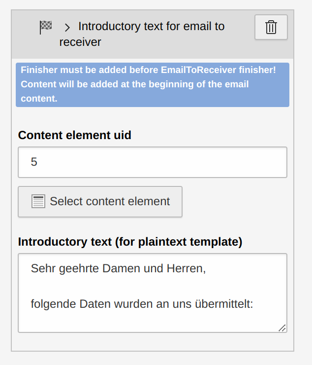
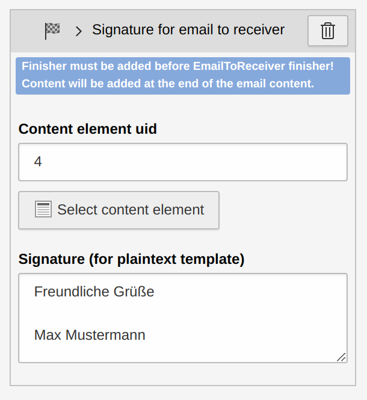
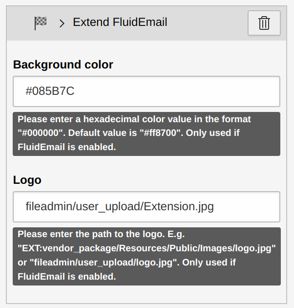

.. include:: ../Includes.txt

.. _introduction:

Introduction
============

Features
^^^^^^^^^^^^^^^^^^^^^^^^^^^^^^^^^^

- Add a content element at the beginning of the email to receiver template
- Add a content element at the beginning of the email to sender template

- Add a content element at the end of the email to receiver template
- Add a content element at the end of the email to sender template

- Edit the background color and logo (relative fileadmin paths and extension paths are possible) of the fluid email template for sender and receiver

- Set form variables that are automatically replaced with the sender's data in the email templates (since version 1.1.0)

What does this extension do?
^^^^^^^^^^^^^^^^^^^^^^^^^^^^^^^^^^

This extension provides additional finishers for the TYPO3 system extension "Form" ([EXT:form](https://docs.typo3.org/c/typo3/cms-form/11.5/en-us/Index.html "EXT:form")). In order for this extension to work as desired, the extension must be installed and configured correctly.

Following finishers are available:

 - `IntroductoryReceiverFinisher` (Adds a content element at the beginning of the email to receiver template)

 - `IntroductorySenderFinisher` (Adds a content element at the beginning of the email to sender template)

 - `SignatureReceiverFinisher` (Adds a content element at the end of the email to receiver template)

 - `SignatureSenderFinisher` (Adds a content element at the end of the email to sender template)

 - `ExtendFluidEmailFinisher` (Edit the background color and logo of the fluid email template for sender and receiver)

All previous finishers must be placed in front of the associated email finishers (`EmailToSender` or `EmailToReceiver`). Otherwise the corresponding content blocks are ignored. The same applies to the ExtendFluidEmailFinisher variables.

For each finisher, the corresponding notes are also displayed in the header of the respective finisher.

Troubleshooting and logging
^^^^^^^^^^^^^^^^^^^^^^^^^^^^^^^^^^

If something does not work as expected take a look at the log file first.
Every problem is logged to the TYPO3 log (normally found in `var/log/typo3_*.log`).

If something still doesn't work as desired after checking the logs, feel free to contact me.

Important notes
^^^^^^^^^^^^^^^^^^^^^^^^^^^^^^^^^^

This extension does not override any of the default EXT:form finisher classes, as it uses the `FinisherVariableProvider` object to share variables between finishers.

But the default email templates are overwritten. If you use several extensions that overwrite the default email templates of EXT:form, conflicts can arise.

