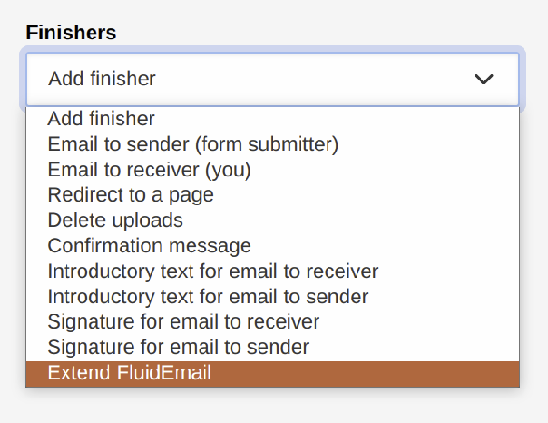
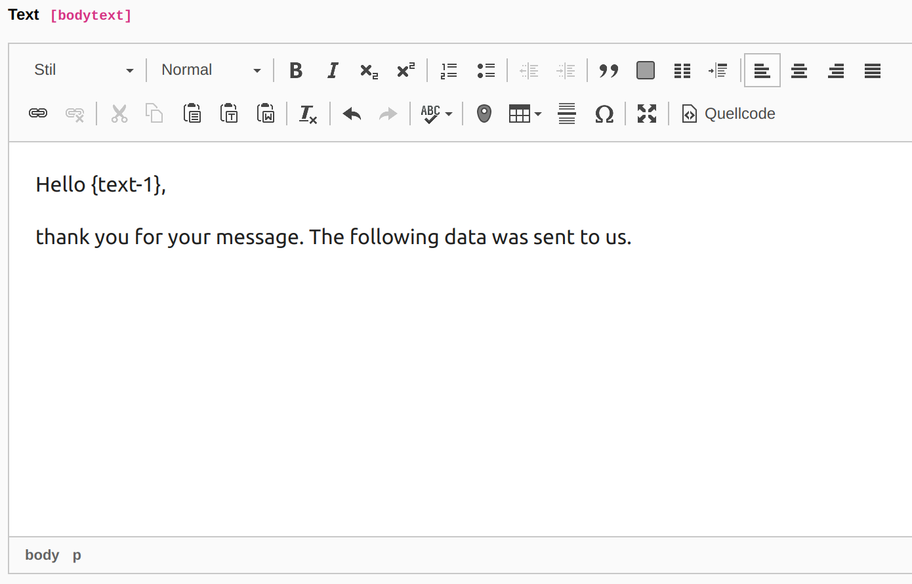

# TYPO3 Extension `Form email contentblocks`

Allows to add a content element at the beginning (introductory text) and/or at the end (signature) of the email templates. Also, the background color and logo of the fluid email template can be edited.

## Features

- Add a content element at the beginning of the email to receiver template
- Add a content element at the beginning of the email to sender template


- Add a content element at the end of the email to receiver template
- Add a content element at the end of the email to sender template


- Edit the background color and logo of the fluid email template for sender and receiver


## Installation

Add via composer:

    composer require "passionweb/form-email-contentblocks"

* Install the extension via composer
* Flush TYPO3 and PHP Cache

## What does this extension do?

This extension provides additional finishers for the TYPO3 system extension "Form" ([EXT:form](https://docs.typo3.org/c/typo3/cms-form/11.5/en-us/Index.html "EXT:form")). In order for this extension to work as desired, the extension must be installed and configured correctly.

Since version 1.1.0 it is possible to [use form variables in the content elements](#add-form-variables-to-content-elements).

Following finishers are available:

 - `IntroductoryReceiverFinisher` (Adds a content element at the beginning of the email to receiver template)

 - `IntroductorySenderFinisher` (Adds a content element at the beginning of the email to sender template)

 - `SignatureReceiverFinisher` (Adds a content element at the end of the email to receiver template)

 - `SignatureSenderFinisher` (Adds a content element at the end of the email to sender template)

 - `ExtendFluidEmailFinisher` (Edit the background color and logo (relative fileadmin paths and extension paths are possible) of the fluid email template for sender and receiver)

All previous finishers must be placed in front of the associated email finishers (`EmailToSender` or `EmailToReceiver`). Otherwise the corresponding content blocks are ignored. The same applies to the ExtendFluidEmailFinisher variables.

For each finisher, the corresponding notes are also displayed in the header of the respective finisher.

## Extension configuration (TypoScript)

All necessary configurations are read in using the [ext\_typoscript\_setup.typoscript](./ext_typoscript_setup.typoscript) file.

```

plugin.tx_form.settings.yamlConfigurations {
    1673535916 = EXT:form_email_contentblocks/Configuration/Yaml/BaseSetup.yaml
}

module.tx_form.settings.yamlConfigurations {
    1673535916 = EXT:form_email_contentblocks/Configuration/Yaml/BaseSetup.yaml
    1673535917 = EXT:form_email_contentblocks/Configuration/Yaml/FormEditorSetup.yaml
}

```

## How editors can/should use the extension

1) Create new or edit an existing form
2) Add the finisher(s) you want to use (and place them in the right order)



3) Save the form

## Add form variables to content elements

Since version 1.1.0 it is possible to use form variables in the content elements or the text fields for the plaintext. You can use it in the same way as in the finisher configurations.



## Troubleshooting and logging

If something does not work as expected take a look at the log file first.
Every problem is logged to the TYPO3 log (normally found in `var/log/typo3_*.log`).

If something still doesn't work as desired after checking the logs, feel free to contact me.

## Important notes

This extension does not override any of the default EXT:form finisher classes, as it uses the `FinisherVariableProvider` object to share variables between finishers.

But the default email templates are overwritten. If you use several extensions that overwrite the default email templates of EXT:form, conflicts can arise.

## Achieving more together or Feedback, Feedback, Feedback

I'm grateful for any feedback! Be it suggestions for improvement, extension requests or just a (constructive) feedback on how good or crappy the extension is.

Feel free to send me your feedback to [service@passionweb.de](mailto:service@passionweb.de "Send Feedback") or [contact me on Slack](https://typo3.slack.com/team/U02FG49J4TG "Contact me on Slack")
